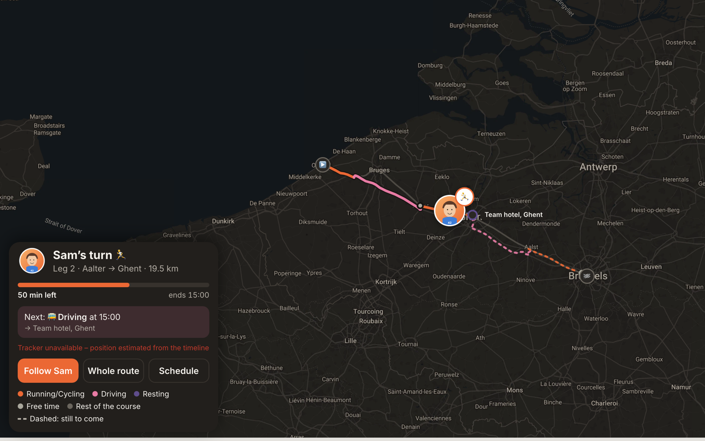

# Relay Race Tracker

A web page for following one person through a multi-leg relay race that
[Chronorace](https://www.chronorace.be) tracks with GPS. It shows friends and
family where that person is right now: running a leg, riding in the team bus,
resting at a hotel or waiting to take over. It also says what comes next and
roughly when.

It was built for one runner in one relay, then made general so anyone can set
it up for someone they want to follow. You need a little comfort with a
terminal, a free Google Maps key and somewhere to host a static page. GitHub
Pages works well and costs nothing.

It is not affiliated with Chronorace or Google. It reads the same live
tracking feed that Chronorace's own tracking page reads, which is not a
documented API and could change.



**Ask first.** This page shows a real person's live location to anyone with
the link. Make sure the runner is happy with that, and leave `site.indexable`
off (the default) unless they want the page to turn up in search engines.

## What it shows

- The runner on a map, with a badge for what they are doing, and their
  vehicle as a separate tag when it has a live position.
- Their whole route for the event. Each leg is drawn on the course, each drive
  on the road Google suggests, and each rest or free time as a stop. What is
  done is solid and what is still to come is dashed.
- A card with what they are doing, how far through it they are, when it will
  end, what is next, and how fresh the GPS position is.
- The full schedule, in the event's time zone.
- A share card and link preview made from the real route, and a birthday cake
  on the day if you give a birthday.

The page speaks English and German, and picks whichever the reader's browser
prefers from the languages you choose.

## What you need

- A Chronorace event with live GPS tracking. You need a tracker that follows
  your runner's team while they run, usually labelled something like `RUN`,
  and one in the vehicle your runner travels in between legs, such as `VAN1`.
- Your runner's own timeline for the event: when each of their legs starts and
  ends and where, when they drive, and where they sleep.
- A photo of your runner. A cut-out with a transparent background looks best,
  but any photo works.
- A Google Maps API key (see below).
- [Node.js](https://nodejs.org) 20 or newer.
- Optionally, a domain of your own. Without one the page is published at
  `https://<your-user>.github.io/<repo>/`, which works just as well.

## Set it up

### 1. Make your own copy

On GitHub, use **Use this template** to make a new repository, then clone it.
Otherwise, clone this one and push it somewhere of your own.

```bash
npm ci
```

### 2. Start your site folder

Everything about your runner and your event lives in one folder, `site/`. The
repository ships with a made-up example in `example-site/`. Copy it:

```bash
cp -r example-site site
```

`site/` is listed in `.gitignore` so that nobody's real details end up in this
shared project by accident. In your own copy you will want to commit it, so
delete the `/site/` line from `.gitignore`.

### 3. Find the event and the trackers

Open the event's live tracking page on Chronorace with your browser's developer
tools open on the Network tab. Look for a request to
`prod.chronorace.be/api/gps/config/` followed by a long number. That number is
the event id. Then list the event's trackers:

```bash
npm run trackers -- 1234567890123456
```

```
Bib   Name       Device         Last position
RUN   Runner     TRK-0107       2027-05-15T07:02:15.153Z
VAN1  Van 1      TRK-0112       2027-05-15T07:02:15.107Z
VAN2  Van 2      TRK-0118       2027-05-15T07:02:07.093Z
```

The `Bib` column is what the config calls each tracker. Put the event id and
the two Bibs in `site/config.json` under `chronorace`.

### 4. Fetch the course

```bash
npm run fetch-route
```

This writes `site/route.json` from Chronorace. Commit it, so the page keeps
working after the event is taken down. If the event has more than one course,
it tells you, and `--track "Name"` picks another.

### 5. Write the schedule

`site/schedule.json` is your runner's own timeline as a list of segments in
order, with no gaps. Every moment from the first segment to the last must
belong to one, so fill any spare time with `free`. Times need their UTC offset,
for example `"2027-05-15T09:00:00+02:00"`.

| Kind    | Means                         | Needs                                        |
|---------|-------------------------------|----------------------------------------------|
| `run`   | one of their legs             | `leg` (its number), `km`, `from`, `to`       |
| `run` with `"finish": true` | running in to the finish together | `from` (where they meet up) |
| `drive` | travelling in the vehicle     | `from`, `to`                                 |
| `sleep` | resting, usually at a hotel   | `at`                                         |
| `free`  | anything else                 | `at` is optional                             |

A place is `{ "name": "Aalter", "lat": 51.087, "lng": 3.4467 }`. The name can
differ by language: `"name": { "en": "Ghent", "de": "Gent" }`. Any segment can
also have a `"label"` that replaces the text the page would write for it.

Use the organisers' exact handover points for the `from` and `to` of each leg
if you can get them. The page uses them to tell when a leg starts and ends,
and a town centre can be a kilometre or more out.

`example-site/schedule.json` is a complete example to copy from.

### 6. Add the photo

Save it as `site/photo.png` (or `.jpg`, `.jpeg`, `.webp`). The build turns it
into a round sticker with a white border for the map, the card, the favicon
and the share card. If you already have a finished sticker, save it as
`site/avatar.png` instead and it will be used exactly as it is.

### 7. Get a Google Maps key

1. Create a project in the [Google Cloud console](https://console.cloud.google.com).
2. Enable the **Maps JavaScript API** and the **Directions API**. Google gives
   a free monthly allowance that a page like this stays well inside.
3. Create an API key. Under **Application restrictions** choose websites and
   add your page's address (for example `https://www.example.com/*`)
   and `http://localhost:8765/*` for trying it out. Under **API restrictions**
   allow only the two APIs above.

The key goes in `site/config.json`. It is not a secret: every visitor's
browser sends it to Google, which is why the restrictions matter.

### 8. Fill in the config

`site/config.json`:

| Setting | What it is |
|---|---|
| `name` | The runner's name, as the page should say it. |
| `emoji` | Their badge while running. Default `🏃`; `🏃‍♀️` and `🚴` also work. |
| `birthday` | `"MM-DD"`, to wish them happy birthday on the day. Optional. |
| `vehicle` | `bus`, `van` or `car`: what the page calls the vehicle. Default `bus`. |
| `languages` | Which of `en` and `de` to offer. The first is the default. Default `["en"]`. |
| `timezone` | The event's time zone, such as `Europe/Brussels`. The schedule is shown in it. |
| `event.name`, `event.from`, `event.to` | The event and where it starts and finishes, for the page's title, description and share card. Each can be a string or one per language. |
| `chronorace.eventId` | The event id, as a string. |
| `chronorace.runnerTracker`, `chronorace.vehicleTracker` | The two Bibs from step 3. |
| `site.url` | The full address the page will be published at, ending in `/`, such as `https://www.example.com/` or `https://<your-user>.github.io/<repo>/`. Link previews need it. |
| `site.indexable` | `true` to let search engines list the page. Default `false`. |
| `mapsApiKey` | The key from step 7. |
| `colours` | Optional. Your own colours as `"#rrggbb"`: `run`, `drive`, `sleep` and `free` for each kind of segment on the map, the card and the share card, and `accent` for the main button, which follows `run` unless given. |
| `tuning` | Optional. See [Tuning](#tuning). |

The build checks all of this and lists anything that is missing or wrong.

### 9. Build it and try it

```bash
npm run build
npm run preview
```

Then open <http://localhost:8765/>. Before the event there is not much to see,
so add `?at=` with a time from your schedule, in the event's time zone, to
preview any moment: <http://localhost:8765/?at=2027-05-15T10:00>. Positions
still come live from the trackers, or are estimated from the schedule when
Chronorace has none.

`npm run build` writes the finished page to `dist/`. Run it again whenever you
change anything in `site/`.

### 10. Publish it

**With GitHub Actions.** The included `Deploy` workflow builds `site/` and
publishes it to GitHub Pages on every push to `main`. In your repository's
settings under **Pages**, set the source to **GitHub Actions**. Actions minutes
are free for public repositories, and private ones get a monthly allowance.

**From a branch.** If you would rather not use Actions, build with
`npm run build -- --out docs`, commit `docs/`, and set Pages to publish the
`docs` folder of `main`.

**On your own domain.** Any domain works, whether a whole domain such as
`example.com` or a subdomain of one you already have. Set it in the
repository's Pages settings, then add the DNS records GitHub's
[custom domain guide](https://docs.github.com/en/pages/configuring-a-custom-domain-for-your-github-pages-site)
gives: `A` and `AAAA` records for a whole domain, or a `CNAME` pointing at
`<your-user>.github.io` for a subdomain. When publishing from a branch, also
put a file named `CNAME` holding just the domain in `site/`, and the build
copies it. Either way, make `site.url` in the config match.

## Page options

- `?at=2027-05-15T04:30` shows any moment of the schedule, read in the event's
  time zone.
- `?lang=de` or `?lang=en` picks the language, so a link can carry one.
- `?theme=light` shows the light map. It is dark by default.

## How it works out where the runner is

The schedule is a guide, and the trackers correct it:

- **On a leg** the runner is where the runner tracker is. A leg stays open past
  its planned end until the tracker is within 300 m of the handover (for up to
  four hours), and ends early if the tracker is more than a kilometre past it
  before its time is up.
- **Before a leg** the runner is waiting in the vehicle until the runner coming
  in reaches them, however late that is. The card estimates when, at an average
  jog of 9 km/h, or at the incoming runner's own pace once the page has watched
  them for a minute.
- **The surest handover point is the vehicle itself.** When it is parked on the
  course near the end of a leg, ahead of the runner, with other team vehicles
  gathered around it and not moving, the leg ends there once the runner is
  within 200 m of it.
- **While running**, once the page has watched for a minute, the card gives
  when the leg will finish at the pace seen along the course, trusting it more
  the longer it watches and fully after twenty minutes.
- **On a drive** the vehicle is followed on Google's route, which is re-routed
  if the vehicle takes another road. The arrival time comes from Google's
  estimate with today's traffic. A drive carries on past its planned end until
  the vehicle is at the door or parked nearby.
- **After the finish** the runner stays on the finish line.
- **If Chronorace fails**, the problem is logged to the browser console and the
  position is estimated from the schedule: time divided equally along the leg
  or the road, or at the stop.

Chronorace is asked for positions every 30 seconds. A position more than 15
minutes old is shown as possibly off.

## Tuning

Every threshold above can be changed under `tuning` in `site/config.json`, in
the units its name gives. The defaults are the values that worked on a real
relay, and each is explained in [`src/config/tuning.js`](src/config/tuning.js).

```json
"tuning": { "jogKmh": 10, "staleMinutes": 10 }
```

## Development

```bash
npm test        # unit tests, with 100% coverage required
npm run ci      # the tests, then a build of the example site
```

`npm run ci` is what continuous integration runs. The repository also has a
pre-push hook in `.githooks/` that runs it. Turn it on with
`git config core.hooksPath .githooks`.

The page is plain ES modules with no bundler, served as they are.

- `src/domain/` works out what the runner is doing and where. It has no DOM and
  no Google.
- `src/services/` talks to Chronorace, Google's directions (through an
  interface), the clock and browser storage.
- `src/ui/` draws the card and handles the sheet on phones.
- `src/maps/google/` is the only code that knows about Google Maps.
- `src/i18n/` holds the languages. Each is one file in `src/i18n/locales/`.
- `src/boot.js` builds everything and connects it. It is the only place that
  constructs collaborators.
- `tools/` is the build and the two Chronorace helpers.

To add a language, copy `src/i18n/locales/en.js`, translate it, and add it to
`src/i18n/locales/index.js`. A test checks that every language has every
string.

## Licence

MIT. See [LICENSE](LICENSE).
